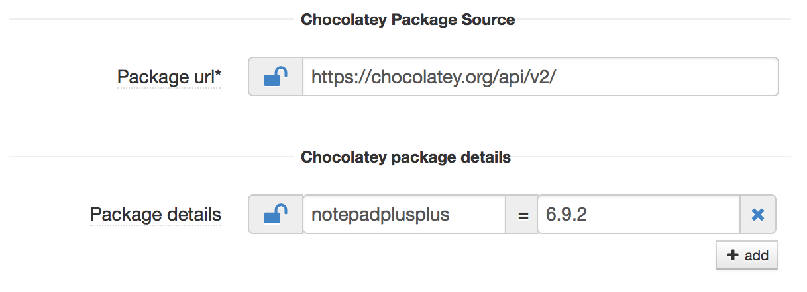

## Chocopackage component

### Overview

Chocopackage component gives the ability to download chocolatey package and install chocolatey package on the Windows machine. Chocolatey is a command line application installer for Windows based on a developer-centric package manager called NuGet. Unlike manual installations, Chocolatey adds, updates, and uninstalls programs in the background requiring very little user interaction. Chocolatey builds on technologies you know - unattended installation and PowerShell. Chocolatey works with all existing software installation technologies like MSI, NSIS, InnoSetup, etc, but also works with runtime binaries and zip archives.

### Parameters

Parameter              | Description                                            | Comments    
---------              |-------------                                           |-----    
Package url           | Url of the chocolatey repository                       | Add the url of the chocolatey package source, this will be overridden if mirror cloud service has been defined.   In the mirror cloud service the key to used be is "chocolatey-repo".
Package details       |  Add the package name and version.              | Format:   Format: <chocolatey package name> = <chocolatey package version>   Examples:   notepadplusplus = 6.9.2   googlechrome = 61.0.3163.79
  

### How it looks?

### Chocolatey
Chocolatey is a package manager for Windows (like apt-get/yum but for Windows). It was designed to be a decentralized framework for quickly installing applications and tools that you need. The applications and tools can be installers like DB drivers, binaries, msi etc, these installers are packaged into chocolatey packages. The chocolatey packages are hosted on repository servers like nexus, artifactory, nuget server and also in local or shared drive.

The public chocolatey repository url is https://chocolatey.org/api/v2/ .
