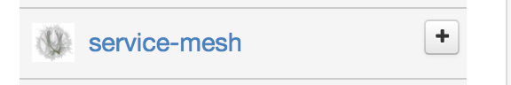
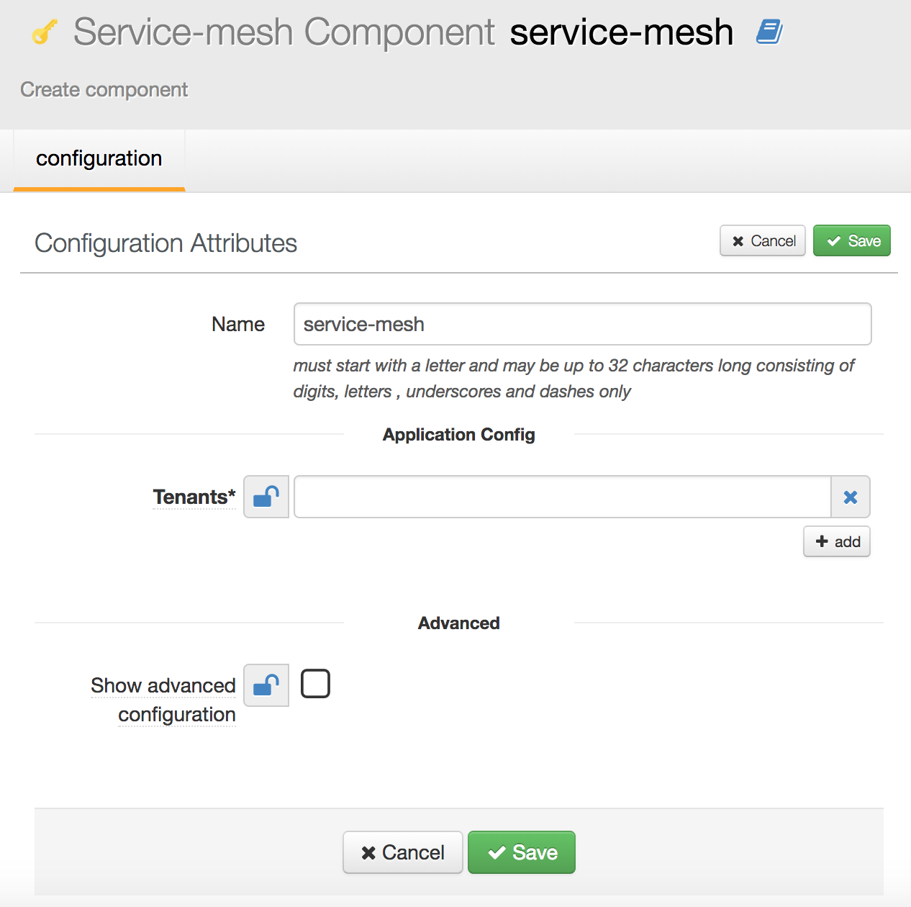
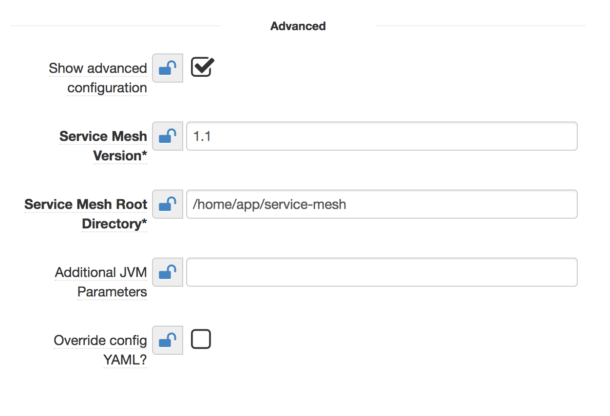
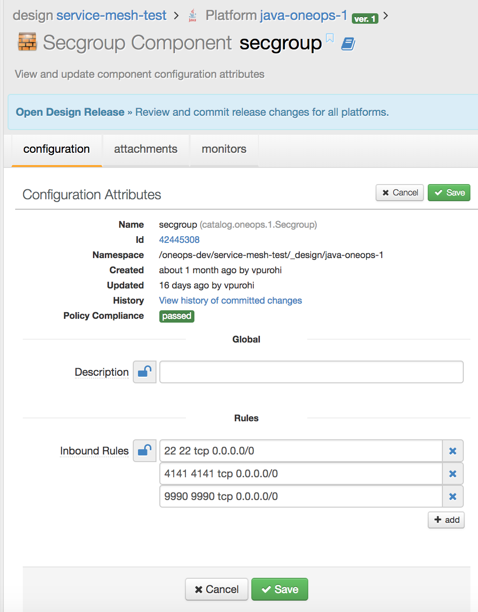
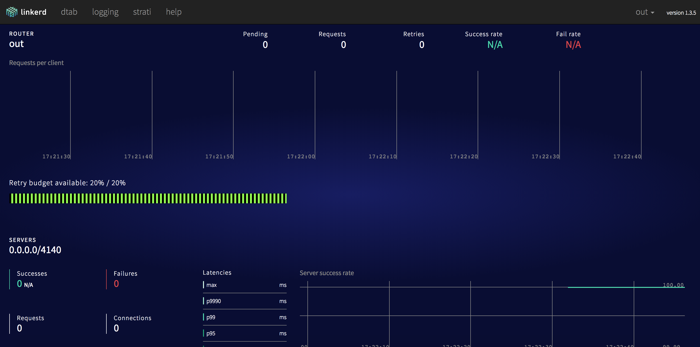

## Description

This component installs the service mesh client on the computes to integrate the application cluster nodes with Walmart's Service Registry portal.

## Prerequisites 

1. Component is available for all packs with linux-based OS. It doesn't work with windows-based platforms yet and is a future work in pipeline.
2. Java should be installed on the computes with minimum version **1.8.0_111**. This requirement is for the initial(pilot) version of service mesh and the final version will not have any dependencies on external java environment (may have embedded JRE with itself, but users won't be exposed to that setup).  
3. Following ports are free and not used by any other process: **4140, 4141, 9990**
4. Users may familiarize themselves with service registry portal by accessing [the user guide](http://gec-maven-nexus.walmart.com/nexus/content/sites/mvn-site/strati-service-registry-doc/userguide/dashboard.html) to learn how to register and manage their applications on service registry.

## How to use the component in OneOps

1. This service-mesh component is available as optional component in all packs across all pack sources, but only non-windows OS is supported on any of the packs. User will need to add the component explicitly in the platform. It will appear as below and user needs to click on '+' icon to add the component instance.   
   
2. After that, following view will open for newly added service-mesh component   
   
3. Make following changes on this page to add service mesh to platform in oneops assembly design:
  * **Name:** Provide any suitable name for the component.
  * **Tenants:** Provide 4 values separated by space in the textfield.
    * First value is _application key for user application in service registry portal_
    * Second value is _name of environment in service registry portal to which this compute/cluster corresponds to_. As this value will depend on the application environment where the oneops design is being deployed, it should be made a oneops variable. This way the design stays consistent across all environments and the environment-specific values are defined in the respective environments.
    * Third value is _the local http address that service mesh process will use to communicate with local application_
    * Fourth value is _the ecv url relative to ingress address that mesh should for ecv purpose_
    * One example of such values is: **`BOOKSTORE-DEMOAPP $OO_LOCAL{SR_ENV_NAME} http://localhost:8080 /ecv.html`**. The variable SR_ENV_NAME can have the environment specific value (e.g. dev, prod etc)
    * The last 2 fields are optional. But to specify ecv url, ingress address must be specified.

4. Click on **Show Advanced Configuration** checkbox to reveal additional fields that may need to be updated.  
  
Update these fields as following:
  * **Service Mesh Version:** Make sure this fields value is 1.7.1 or higher (as recommended by SOA team)
  * **Service Mesh Root Directory:** Directory where service mesh related resources will be placed on computes in the application environment. User can keep the same value or update if desired.
  * **Additional JVM Parameters:** Optional field to pass any other JVM parameters as recommended by SOA team
  * **Override config YAML:** Optional field to override the mesh config yaml file if needed. This is to perform quick config change tests and is not recommended/expected to be used for general purposes. If selected, it will display another textbox to populate the config yaml which SOA team can provide.
5. Click on _Save_ button to save this component to the design.
6. Before committing the design, user will need to ensure that ports 4141, 9990 are opened by modifying the **secgroup** component in the platform design. Refer to the **Inbound Rules** section in the image below to see how these 2 ports should be added as 2 entries along with any other already present port entries:  
   
7. Now user can commit the design and pull it in any of the environments. Once the service mesh component is deployed successfully, user can do a quick verification by hitting following URL on any of the computes in the environment where this design was deployed: _http://<compute-ip>:9990_. This should open a linkerd admin console as displayed below.   
  
8. By this step, the service mesh component is successfully installed and running on all computes in the application environment where the design was deployed. For any further queries, reach out to SOA team on support slack channel. Service registry user guide is availalbe [here](http://gec-maven-nexus.walmart.com/nexus/content/sites/mvn-site/strati-service-registry-doc/userguide/dashboard.html).
