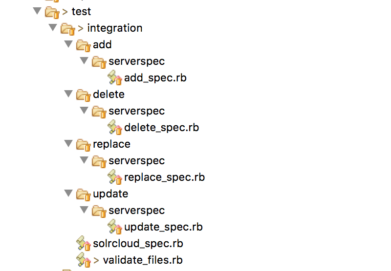

* [What is Kitchen Verify? ](#what-is-kitchen-verify)
* [Implementing Kitchen Verify](#implementing-kitchen-verify)
* [Accessing node attributes inside Kitchen Verify](#accessing-node-attributes-inside-kitchen-verify)
* [Solrcloud Tests Using Kitchen Verify](#solrcloud-tests-using-kitchen-verify)
 * [Executing command](#executing-command)
 * [Verifying if file exists](#verifying-if-file-exists)
 * [Validating monitor scripts](#validating-monitor-scripts)
 * [Validating property files](#validating-property-files)
 * [Validating xml files](#validating-xml-files)

### What is Kitchen Verify
Being able to manually verify the Chef run is great but it would be even better if we had an executable test that would fail if our assumptions were ever proven to be false. For further details please visit https://kitchen.ci/docs/getting-started 

### Implementing Kitchen Verify

  Create below file **_/solrcloud/test/integration/solrcloud_spec.rb_** with below contents-
	
	require "#{File.dirname(__FILE__)}/validate_files"
  
  Add Kitchen verify tests in the file - 

	/solrcloud/test/integration/validate_files.rb
  Create **_/solrcloud/test/integration/{action}_spec.rb_** files for actions for which kithen test to be verifed as shown in the image below-
  

### Accessing node attributes inside Kitchen Verify
Make sure to add below line in test file in order to make node attributes available to tests

	require "#{$circuit_path}/circuit-oneops-1/components/spec_helper.rb"

Node attributes can be accessed by using $node as below-
	
	port = $node['solrcloud']['port_no']
	jolokia_port = $node['solrcloud']['jolokia_port']
### Solrcloud Tests Using Kitchen Verify
####  Executing command

	def execute_command(cmd)
  function execute_command(cmd) is used to execute the given command. 
  This function throws error if command fails otherwise return list of command output
  This function is used to validate the blow commands-
  
    /opt/nagios/libexec/check_solr_mbeanstat.rb MemoryStats #{port}
    /opt/nagios/libexec/check_solr_mbeanstat.rb ReplicaStatus #{port}
    /opt/nagios/libexec/check_solr_mbeanstat.rb JVMThreadCount #{jolokia_port}
    /opt/nagios/libexec/check_solr_mbeanstat.rb HeapMemoryUsage #{jolokia_port}
  
  
####  Verifying if file exists

	get_file_path('/etc/init.d/solr[0-9]*',multiple_files_expected=true)

  get_file_path(regex,multiple_files_expected=true) function search for the file path matching the regex. 
  If multiple_files_expected=true, then it return all the files matching the regex. 
  If multiple_files_expected=false and if mutliple files found matching the regex, function throws the error otherwise returns file matching regex
  This function is used to find if file exists and return the file path if exists-

	/etc/init.d/solr7
	/opt/nagios/libexec/check_solrprocess.sh
	/opt/nagios/libexec/check_solr_mbeanstat.rb
	/opt/solr/solrmonitor/metrics-tool.rb
	/opt/nagios/libexec/check_solr_zk_conn.sh
	/app/solrdata7/log4j.properties
	/app/solr7/server/solr/solr.xml
 
####  Validating monitor scripts
  
	def validate_monitor_status(monitor_path, args, expected_status)

  validate_monitor_status function executes the given monitor scripts and verify that actual monitor status is eqaul to expected status.
  Funtion throws error if the monitor execution fails
  
  Below monitor scripts are validated for status 100-
	
	/opt/nagios/libexec/check_solrprocess.sh #{port}
	/opt/nagios/libexec/check_solr_zk_conn.sh 100
  
####  Validating property files

	def validate_property_file(file_path)
	
  validate_property_file(file_path) function validate the property file for any syntax error.
  This function reads the property file and for each line, split by '=' and constructs key value pair
  Below files are validated using this function-
    
    /app/solrdata7/log4j.properties
  
####  Validating xml files

	def validate_xml(xml_file)
	
  function validate_xml(xml_file), validates the xml file for any syntax errors
  
  Below files are validated using this function-

	/app/solr7/server/solr/solr.xml