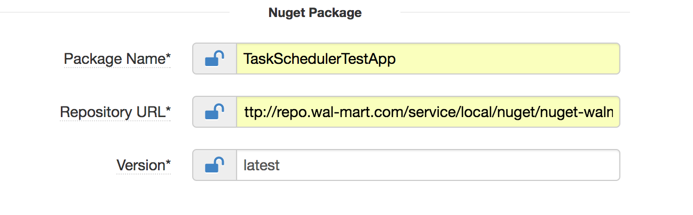
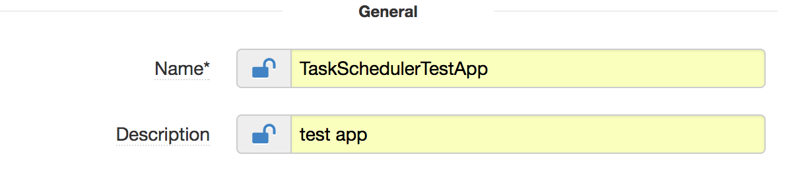
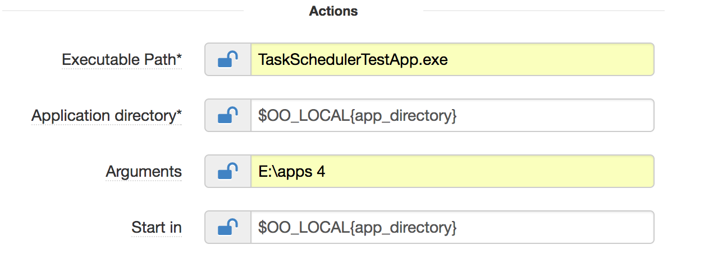
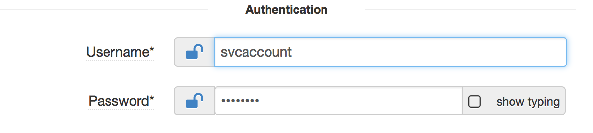
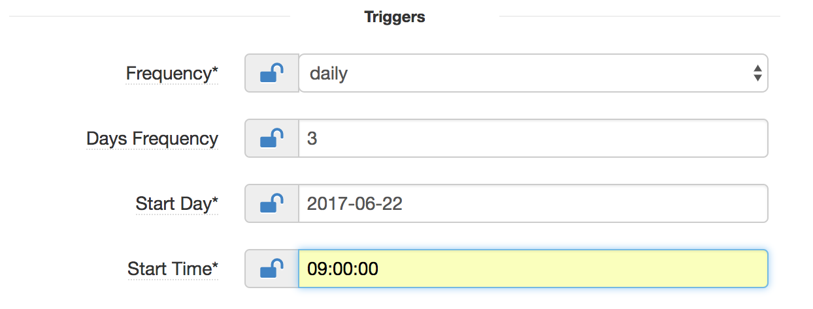
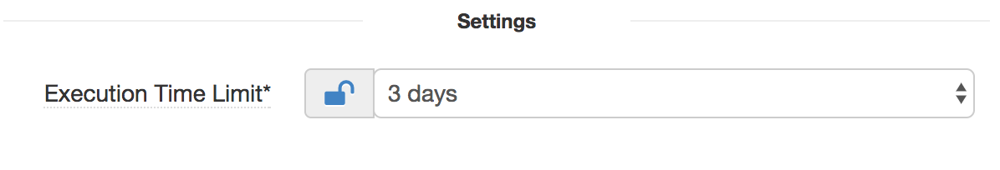

## TaskScheduler

### Overview

Taskscheduler component gives us the ability to create scheduled jobs using windows taskscheduler. The scheduled jobs can be a .Net console application or can be a script.

Taskscheduler component has got the following sections:

* Nuget Package section
* General section
* Actions section
* Authentication section
* Triggers section
* Settings section

### Nuget Package section

In this section, you need to add the nuget package details

Attribute              | Description                                                          | Notes
---------              |-------------                                                         |-----  
Package Name           | Name of the package                                                  | Ex: TaskSchedulerTestApp
Repository URL         | Base url in nexus repository                                         | Ex: https://api.nuget.org/v3/index.json
Version                | Version of the package                                               | Default value: latest, Ex: 1.0.18

### General section

In this section, you specify the general information.

Attribute              | Description                                                          | Notes
---------              |-------------                                                         |-----  
Name                   | Name of the task                                                     | Ex: TaskSchedulerTestApp
Description            | Description of the task                                              | Ex: Test TaskScheduler

### Actions section

In this section, you need to specify the actions details.

Attribute              | Description                                                          | Notes
---------              |-------------                                                         |-----  
Executable Path        | Path to the program/script to be scheduled                                                                 | Ex: TaskSchedulerTestApp.exe
Application directory  | Application Directory where the package is to be installed           | Ex: e:\apps
Arguments              | Arguments to be supplied to the program/script                       | Ex: e:\apps 4
Start in               | Path to the directory from where the program/script is to be run     | Ex: e:\apps

### Authentication section

In this section, you provide the user account details under which the task need to be run.

Attribute              | Description                                                          | Notes
---------              |-------------                                                         |-----  
Username               | User under which the program/script is to be run                     | Ex: svcaccount
Password               | Password of the user                                                 |

### Triggers section

In this section, you provide the triggers details.

Attribute              | Description                                                          | Notes
---------              |-------------                                                         |-----  
Frequency              | Type of the Trigger                                                  | Ex: daily
Days Frequency         | Frequency of days to run the task in case selected trigger is "daily"  | Ex: 3
Days of Week           | Days of week to run the task in case selected trigger is "weekly"      | Ex: Sunday
Weeks Frequency        | Frequency of Weeks to run the task in case selected trigger is "weekly"                                    | Ex: 2
Start Day              | Start day of the task, Format: yyyy-mm-dd                              | Ex: 2017-06-21
Start Time             | Start time of the task, Format HH:MM:SS                                | Ex: ex 23:30:00, 07:45:00

### Settings section

In this section, you can set the settings like execution time limit.

Attribute              | Description                                                          | Notes
---------              |-------------                                                         |-----  
Execution Time Limit   | Stop the task if the task runs longer than given time                | Ex: 1 hour
