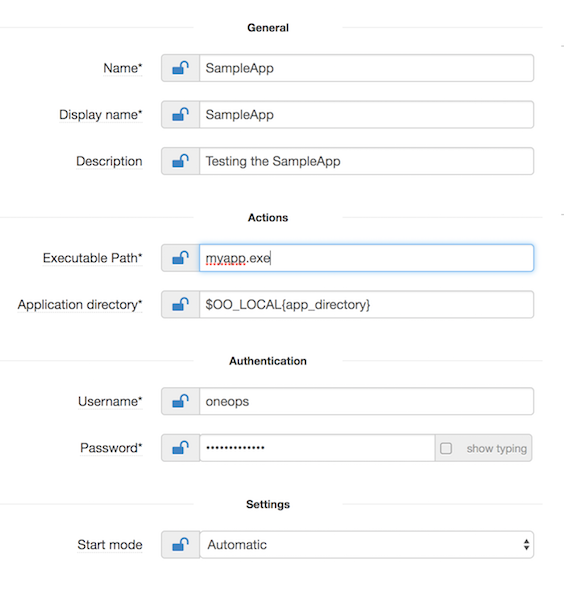

## Windows Service

### Overview

The Windows service component enable you to create long-running executable applications that run in their own Windows sessions . This component uses Windows Service to schedule the tasks.

Windows service has got followings parameter:

* Package Name
* Repository URL
* Version
* Service Name
* Display name
* Executable Path
* Application directory
* Startup type
* User Account

### WindowsService Parameters
In this section you configure windows service attributes

 Attribute                | Description                                                                     | Comments   
 ---------                |-------------                                                                    |-----    
 Name                     | The name of the Windows Service to create, or re-configure if it already exists | The service name is a short name used to identify the service to the system. It may or may not be same as the service display name .
 Display name             | Display name of the service                                                     | The service display name is the name which will be visible in the windows service services control manager.
 Executable Path          | Path to the program/script to be installed as service. Path should be relative to the package installation directory, ex bin\test.exe, myapp.exe                                                 | The relative path to the executable in the package that the Windows Service will point to. Examples: bin\test.exe, myapp.exe           
 Application directory    | Application directory where the package is to be installed. Ex e:\apps          |
 Username                 | User under which the program/script is to be run as a service                   |
 Password                 | Password of the user                                                            |
 Start mode               | When will the service start ?                                                   | The startup type can be set to:   1. *Automatic*: the service will be started at boot time.   2. *Manual*: the service will start only when needed.   3.*Disabled*: the service will never start, even when its functionality is requested by other Windows services or applications.
