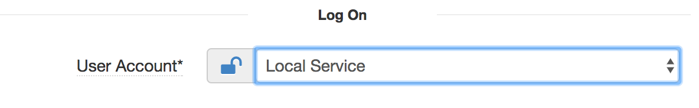
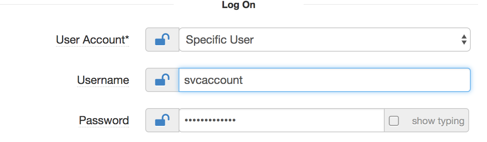

## IIS-website

### Overview

The Windows service component enable you to create long-running executable applications that run in their own Windows sessions . This component uses Windows Service to schedule the tasks.

Windows service has got followings sections:

* Nuget Package section
* General section
* Log On section

### Nuget Package section

In this section, you need to add the nuget package details

Attribute              | Description                                                          | Notes
---------              |-------------                                                         |-----  
Package Name           | Name of the package                                                  | Ex: TestWindowService
Repository URL         | Base url in nexus repository                                         | Ex: https://api.nuget.org/v3/index.json
Version                | Version of the package.         | Default value: latest, Ex: 1.0.18

### General section
In this section you configure application pool attributes.

 Attribute                | Description                                                                     | Comments   
 ---------                |-------------                                                                    |-----    
 Service Name                     | The name of the Windows Service to create, or re-configure if it already exists | The service name is a short name used to identify the service to the system. It may or may not be same as the service display name .
 Display name             | Display name of the service                                                     | The service display name is the name which will be visible in the windows service services control manager.
 Executable Path          | Path to the program/script to be installed as service. Path should be relative to the package installation directory, ex bin\test.exe, myapp.exe                                                 | The relative path to the executable in the package that the Windows Service will point to. Examples: bin\test.exe, myapp.exe           
 Application directory    | Application directory where the package is to be installed. Ex e:\apps          |
 Startup type             | When will the service start ?                                                   | The Startup type can be set to:   1. *Automatic*: the service will be started at boot time.   2. *Manual*: the service will start only when needed.   3.*Disabled*: the service will never start, even when its functionality is requested by other Windows services or applications.
 Start parameters         | Arguments to be supplied to the service when it runs                                        |
 Dependencies             | other services/components on which your service depends                                                                               |  

 ### Log On section

 

 

 Attribute                | Description                                                                     | Comments   
 ---------                |-------------                                                                    |-----    
 User Account             | The service account under which your service will run                                                                                | The account can be set as :   1. *Local Service Account*: Use the Local Service user account if the worker process does not require access outside the server on which it is running.   2. *Network Service Account*: A service that runs in the context of the NetworkService account presents the computer's credentials to remote servers.   3. *Specific User*: Please make sure that the user has been granted Log On as a <b>service rights</b>.
 Username                 | User under which the program/script is to be run as a service if specific user account is chosen.                   | Ex: svcaccount
 Password                 | Password of the user                                                            |
